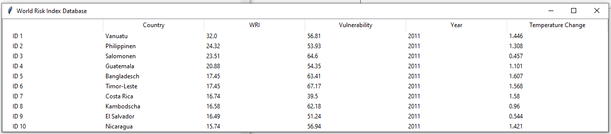
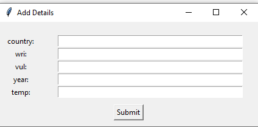
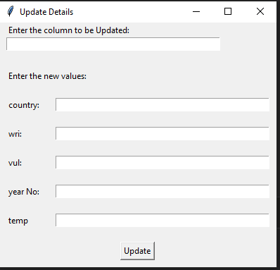
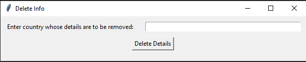
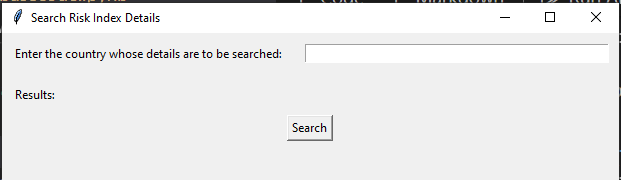

# WRI_DB is a CMS project for handlign world risk data using a GUI interface.

## Project Description
The project is divided into three parts:
- Part 1: Data Importing, Filtering, and Cleaning
- Part 2: Application GUI that performs five functions (Display Insert, Update, Delete, and Search)
- Part3: General Template to get requried information by giving country name and year.

## Project Files
- [Jupyter Notebook](/basecode.ipynb)
- [Part 1 Code (Python)](/wrisk_main1.py)
- [Part 2 Code (Python)](/wrisk_main2.py)
- [Test Code to Check Application (Python)](/testcode.py)
- [Database](/risk_index.db)
- [Origional Data (CSV)](/data/)
# Part 2: Application Structure
TO run part 2, open the "testcode.py" file in python IDE, and run each function individually.

Specifically, the application performs 5 operations which are shown below.

## First Function: Display all data


## 2nd Function: Insert data into database


## 3rd Function: Update data from database


## 4th Function: Delete data from database


## 5th Function: Search data fronm database


# Part 3: Template example

```python
#inputs
Country = Pakistan
Year = 2019
```
## Results
```
The temperature change of Pakistan is 1.021 for the year 2019. Furthermore, the WorldRiskIndex (WRI) is 7.08 and Vulnerability is 56.52
```